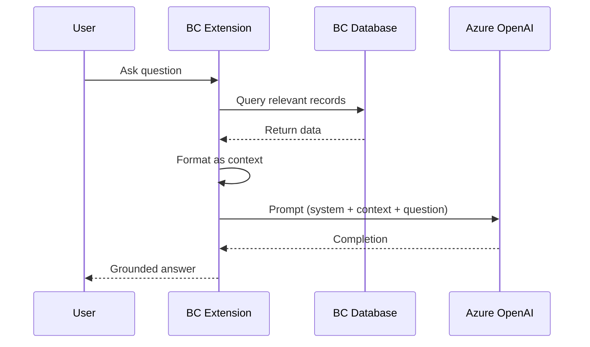

# RAG — Retrieval-Augmented Generation

## Pattern
```
User Question
     │
     ▼
1. Extract keywords
2. Query BC tables (Item, Customer, G/L, etc.)
3. Format results as context text
4. Build prompt: System + Context + Question
5. Call Azure OpenAI
6. Return grounded answer
```

## Mermaid Diagram


## Tips
- Keep context under 8,000 tokens
- Pre-filter BC data aggressively
- Show source references for user trust