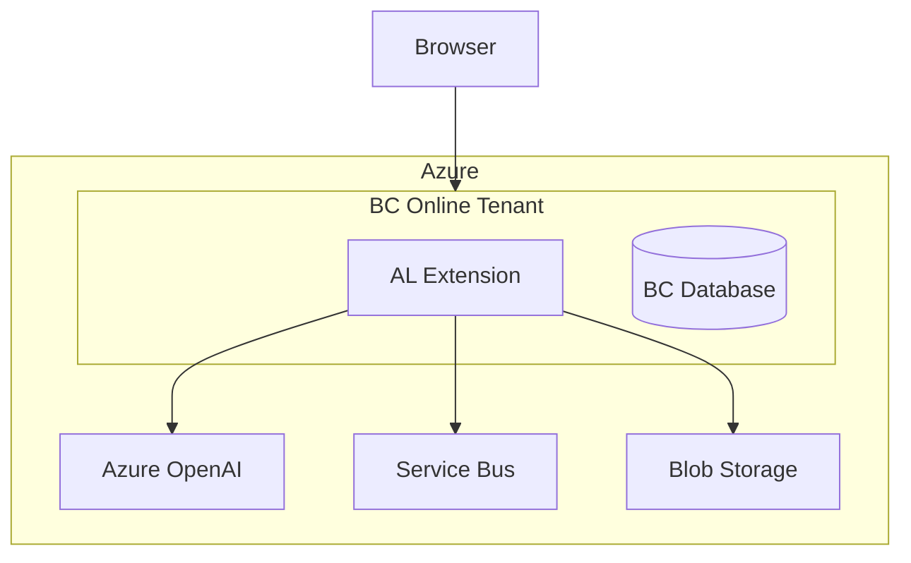
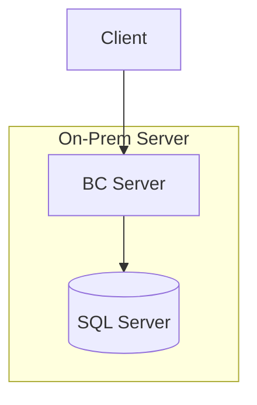

# Deployment Architecture

## SaaS (BC Online)

## On-Premises

## Multi-Tenant ISV
Single .app file deployed across N tenants.
Each tenant data isolated in separate BC company/database.
Use Isolated Storage (Module scope) for per-tenant secrets.