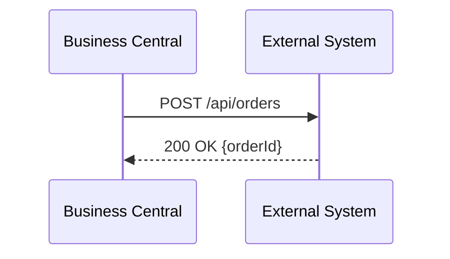
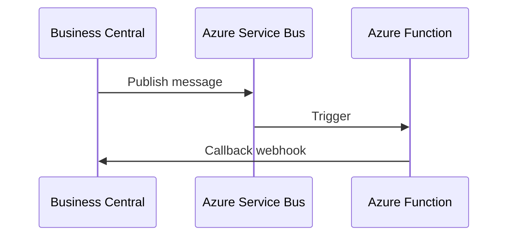
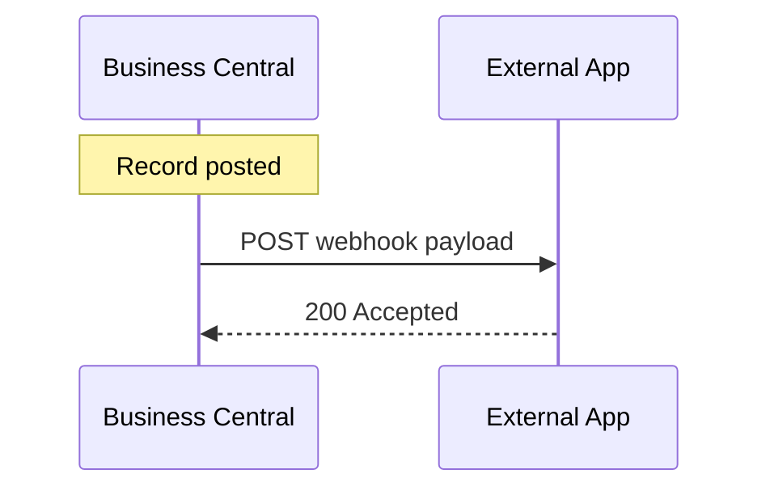

# BC Integration Patterns

## Pattern 1: Synchronous REST

Use when: real-time response needed.

## Pattern 2: Async Service Bus

Use when: high volume, long-running processing.

## Pattern 3: Webhook Push

Use when: external systems react to BC events.

## Pattern 4: OData Pull
Use when: Power BI, Power Apps, reporting tools read BC data.

## Selection Guide
| Scenario | Pattern |
|----------|---------|
| Portal order submission | Synchronous REST |
| Nightly ERP sync | Async Service Bus |
| Invoice posted → notify | Webhook Push |
| Power BI dashboard | OData Pull |