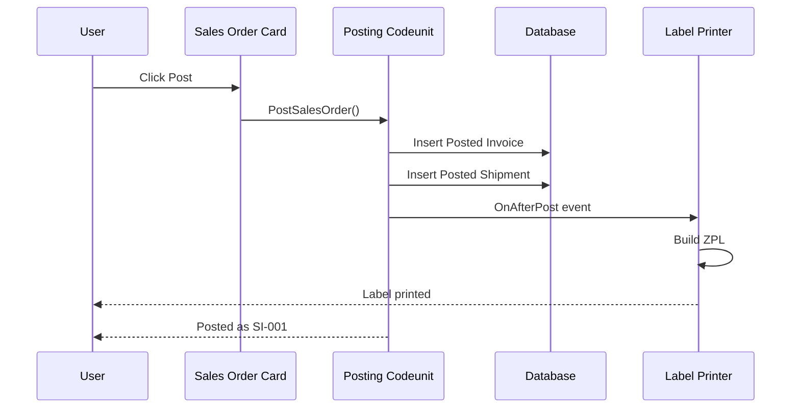
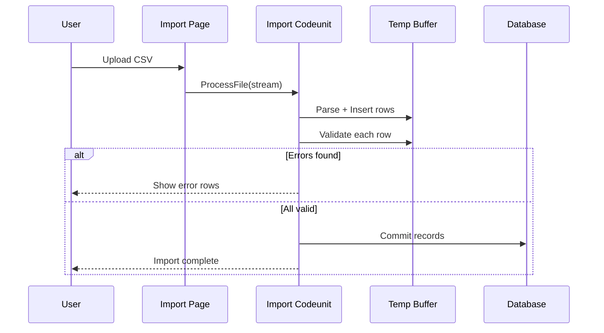

# Sequence Diagrams

## Sales Order to Shipment

```mermaid
sequenceDiagram
    participant User
    participant Page as Sales Order Card
    participant CU as Posting Codeunit
    participant DB as Database
    participant Label as Label Printer

    User->>Page: Click Post
    Page->>CU: PostSalesOrder()
    CU->>DB: Insert Posted Invoice
    CU->>DB: Insert Posted Shipment
    CU->>Label: OnAfterPost event
    Label->>Label: Build ZPL
    Label-->>User: Label printed
    CU-->>User: Posted as SI-001
```

## CSV Import Flow

```mermaid
sequenceDiagram
    participant User
    participant Page as Import Page
    participant CU as Import Codeunit
    participant Buf as Temp Buffer
    participant DB as Database

    User->>Page: Upload CSV
    Page->>CU: ProcessFile(stream)
    CU->>Buf: Parse + Insert rows
    CU->>Buf: Validate each row
    alt Errors found
        CU-->>User: Show error rows
    else All valid
        CU->>DB: Commit records
        CU-->>User: Import complete
    end
```