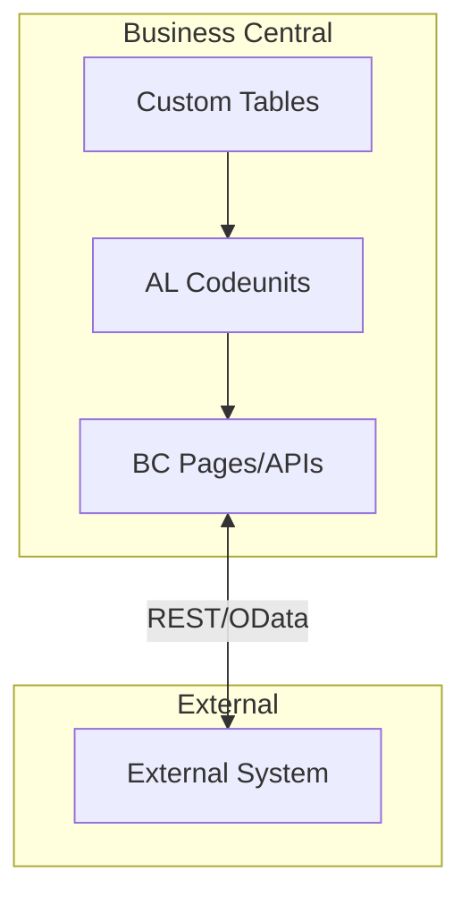

# ApprovalWorkflow — Architecture

## System Overview

## Key Technologies
Events, Approval Entry, Email

## Data Flow
1. External trigger or user action
2. AL validates input
3. Business logic executes
4. Events fire for extensibility
5. Data committed
6. Response returned
